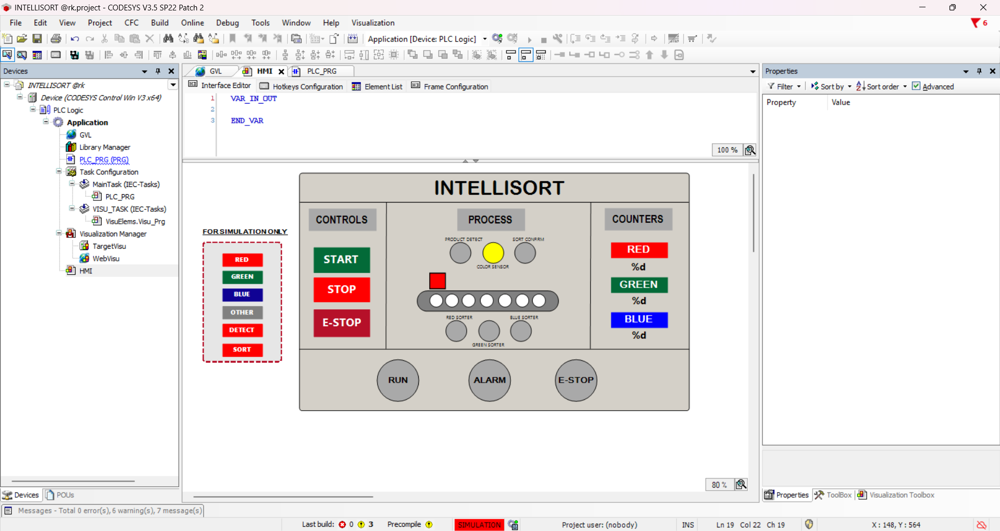
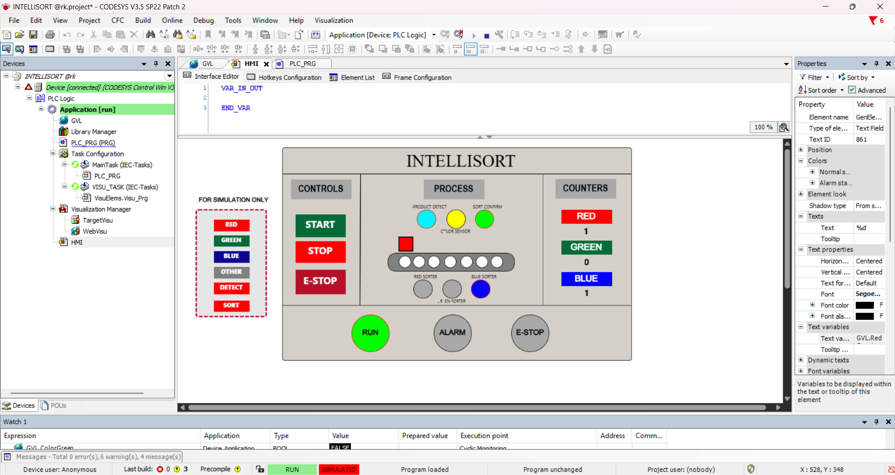

# INTELLISORT

### PLC-Based Conveyor Color Sorting System

INTELLISORT is a simulation-based industrial automation project developed using **CODESYS V3.5 SP22**.

The system simulates a conveyor-based color sorting process in which products are detected, identified by color, and directed to the corresponding sorting output.

This project demonstrates the practical application of **PLC programming, Ladder Diagram, Structured Text, HMI visualization, counters, sensor logic, and emergency-stop control**.

---

## Project Overview

INTELLISORT is designed to simulate an automated conveyor sorting system.

When a product is detected, the selected color is identified. The corresponding sorter output is activated, and after sorting confirmation, the relevant product counter is increased.

The project was developed as a learning and simulation project to understand the basic workflow of an industrial automation system.

---

## Main Features

- Conveyor motor control
- Product detection
- Red, green, and blue color identification
- Unknown/other product detection
- Individual sorting outputs
- Separate counters for each color
- HMI-based control and monitoring
- Simulation-only control section
- Sort confirmation using rising-edge detection
- Emergency-stop and reset logic
- PLC programming using LD and ST
- CODESYS visualization

---

## System Working

```text
Start
  ↓
Conveyor Runs
  ↓
Product Detected
  ↓
Color Identified
  ↓
Corresponding Sorter Activated
  ↓
Sort Confirmation
  ↓
Product Counter Increased
  ↓
Sorter Reset
  ↓
System Ready for Next Product
```

---

## Color Sorting Logic

| Product Type | Sorting Output | Counter |
|---|---|---|
| Red | RedSorter | RedCount |
| Green | GreenSorter | GreenCount |
| Blue | BlueSorter | BlueCount |
| Other/Unknown | No color sorter | No color counter |

Each color has its own counter so that products are counted independently.

---

## Main Components

### PLC

The PLC executes the control logic and processes the sensor inputs.

### Conveyor Motor

The conveyor transports products through the sorting process.

### Product Detection

The product detection input identifies when a product is present.

### Color Sensors

The simulation uses separate inputs for:

- Red
- Green
- Blue
- Other/Unknown

### Sorting Outputs

The corresponding sorter output is activated according to the detected color.

### Sort Confirmation

The sort confirmation signal confirms the sorting operation and triggers the counter increment.

### HMI

The HMI provides operator controls, process indications, simulation buttons, and product counters.

---

## Software Used

- **CODESYS V3.5 SP22**
- **Ladder Diagram (LD)**
- **Structured Text (ST)**
- **CODESYS Visualization**

---

## Input and Output Overview

### Inputs

| Variable | Description |
|---|---|
| `GVL.Start` | Starts the system |
| `GVL.Stop` | Stops the system |
| `GVL.EmergencyStop` | Emergency-stop input |
| `GVL.EStopReset` | Resets the emergency-stop condition |
| `GVL.ProductDetect` | Detects a product |
| `GVL.SortConfirm` | Confirms sorting |
| `GVL.ColorRed` | Red color detection |
| `GVL.ColorGreen` | Green color detection |
| `GVL.ColorBlue` | Blue color detection |
| `GVL.Unknown` | Unknown/other product detection |

### Outputs

| Variable | Description |
|---|---|
| `ConveyorMotor` | Controls conveyor movement |
| `RedSorter` | Activates red sorting mechanism |
| `GreenSorter` | Activates green sorting mechanism |
| `BlueSorter` | Activates blue sorting mechanism |

### Counters

| Variable | Description |
|---|---|
| `RedCount` | Number of red products sorted |
| `GreenCount` | Number of green products sorted |
| `BlueCount` | Number of blue products sorted |

---

## HMI

The HMI includes:

- Start and Stop controls
- Emergency Stop control
- Process visualization
- Product detection indication
- Color sensor indication
- Red, green, and blue sorter indications
- Individual product counters
- Simulation-only color selection buttons
- Product Detect and Sort Confirm controls
- Run and Alarm status indications

---

## HMI Screenshots

### Main HMI

The main HMI provides the control panel, process visualization, simulation controls, and product counters.



### Running State

The running state shows the conveyor operating and the sorting process active during simulation.



### Alarm State

The alarm state shows the HMI response when the alarm condition is active.


---

## Simulation Procedure

To test a red product:

1. Reset the simulation.
2. Start the conveyor.
3. Activate `ProductDetect`.
4. Select the red color.
5. Activate `SortConfirm`.
6. Observe the red sorter and red counter.
7. Reset the simulation before testing the next product.

The same procedure can be followed for green and blue products.

> The simulation controls are used to imitate sensor signals because physical sensors and actuators are not connected.

---

## Safety

The project includes emergency-stop and reset logic.

When the emergency stop is activated, the controlled operation is stopped. The reset input is used to clear the emergency-stop condition.

> This project is a simulation and is not intended for direct use on industrial machinery without proper safety validation and hardware implementation.

---

## Project Structure

```text
INTELLISORT/
│
├── README.md
├── INTELLISORT.project
│
└── Images/
    ├── hmi.png
    ├── running.png
    └── alarm state.png
```

---

## Learning Outcomes

Through this project, I learned:

- PLC project planning
- I/O mapping
- Ladder Diagram programming
- Structured Text programming
- HMI design in CODESYS
- Rising-edge detection
- Counter implementation
- Sensor-based control logic
- Emergency-stop handling
- PLC simulation and testing
- Basic industrial automation workflow

---

## Future Improvements

- Integration with real color sensors
- Integration with physical actuators
- Conveyor speed control
- Automatic product spacing
- Fault and alarm management
- Data logging
- Production statistics
- Industrial communication
- Improved HMI diagnostics

---

## Author

**Saurabh Verma**

Electrical Engineering Student  
Interested in PLC Programming, Industrial Automation, and Control Systems.

---

## License

This project is intended for educational and learning purposes.
